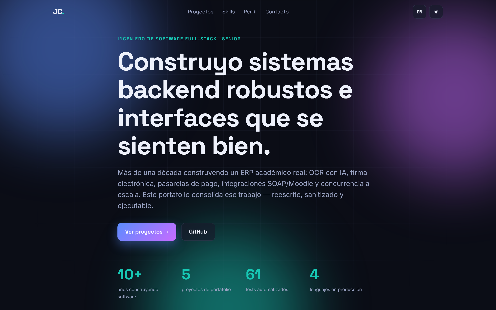

# Portfolio — Jefferson Cuadrado

> Personal portfolio site. React 19 + TypeScript + Vite + Framer Motion. Bilingual (ES/EN), dark/light, accessible, deployed to GitHub Pages.

**Live:** https://jcuadradoh2.github.io/portfolio/

<p align="center">
  
</p>

## Features
- **Bilingual** ES/EN toggle (persisted), **dark/light** theme (respects `prefers-color-scheme`, persisted).
- Animated aurora hero, scroll-reveal sections (IntersectionObserver), count-up stats, project carousels.
- Fully **responsive** and **accessible** — semantic HTML, `:focus-visible`, `prefers-reduced-motion`, aria labels.
- Auto-deployed to **GitHub Pages** via GitHub Actions.

## Run

```bash
npm install
npm run dev      # http://localhost:5173
npm run build    # -> dist/
```

## Stack
React 19 · TypeScript · Vite · Framer Motion · CSS custom properties (theming).

---

*Part of [Jefferson Cuadrado's engineering portfolio](https://github.com/jcuadradoh2).*
